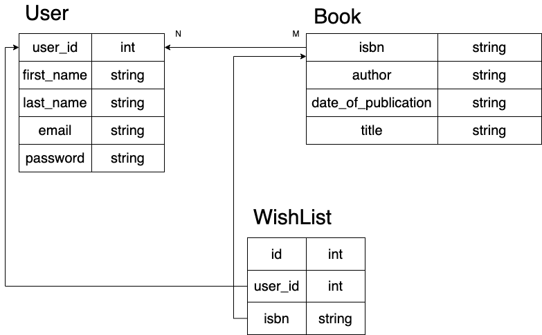

# book_wishlist
## Requirement
Please create a RESTful API in Python 3 to manage a user's book wishlist. Please feel free to use any web framework or other tools of your choice. This includes any database of your choice, though we would recommend SQLite for portability.
 
We would like to see API calls to add, update, or delete books from a user's wishlist.
 
For convenience, we've included what attributes users and books should have:
####	User
  -	First name
  -	Last name
  -	email
  -	Password
####	Book
  -	Title
  -	Author
  -	ISBN
  -	Date of publication
 
Tests are required.
Auth is not required.
 
Please also include a write-up of design and technology choices.
Extension for document – If you have to scale your API to GoodReads scale. What would you change in your design. Include any design diagrams that help us understand it better.

## Running Instruction
- Running the following command will start a PostgreSQL database, load sample data into it and start the Flask service

`
docker-compose up
`
- Rebuild postgres

`
rm -rf ./pg_data && docker-compose up
`
- Access postgres:

`
psql -U postgres -h localhost -d zonar
`

## Running Test
There are 3 folders under tests
- Integration: test post / put /delete endpoint
- Model: test model __str__ , __repr__, to_dict function
- Resource: unit test

`
cd src
pytest tests
`

## Note
- This endpoint is built using Flask
  - main reason I picked this because Flask is good for smaller project, easy to setup. __PLUS I already have boilerplate setup with docker.__
  - Same reason I choose to use Postgres, try to avoid wasting time on seting up project and focus on building and endpoints.
  - Did not have time to use flask migrate so go with easy route - create table schema during docker setup.
  - Ran out time + tired so code a little messy. LOL
- Future imrpovement: 
  - Add swagger doc
  - Refactor validate function
  - Let flask manage db ?
  - Maybe hash +salt password field ? 

## Design

